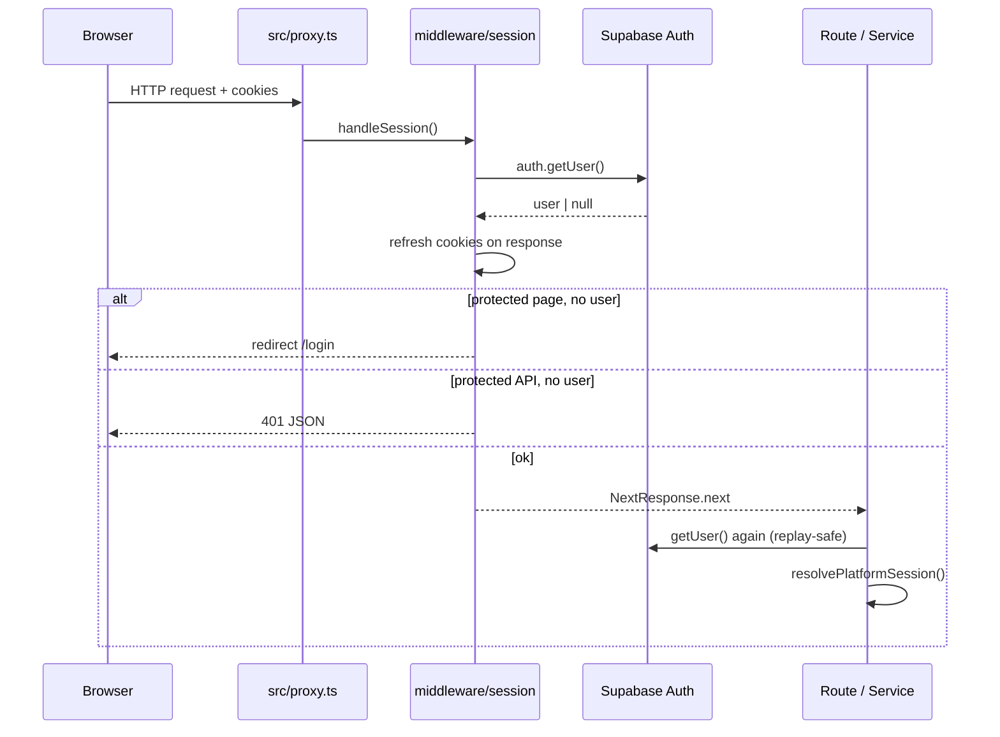

# Session Lifecycle

## Request flow

## Cookie handling

- `@supabase/ssr` manages auth cookies on server and middleware paths.
- `handleSession` in `middleware/session.ts` refreshes tokens via `getUser()` (validates JWT server-side).
- Production cookies should use `secure: true` (see `src/shared/config/auth.ts`).

## Platform session resolution

1. `createSupabaseServerClient()` reads cookies.
2. `defaultAuthProvider.getUser()` validates JWT.
3. `IdentityRepository` loads `auth_accounts` and actor row.
4. `resolveAppRole()` maps to application role.
5. `PlatformSession` returned to handlers.

**Replay safety:** Authorization never uses unvalidated `getSession()` claims. Both middleware and services call `getUser()`.

## Session API

`GET /api/v1/auth/session`

| State | Response |
|-------|----------|
| Unauthenticated | `{ authenticated: false }` |
| Authenticated | `toPlatformSessionPayload(session)` — no tokens |

## Sign-out

Use `defaultAuthProvider.signOut(client)` via server client when implementing logout.

## Platform `sessions` table

`public.sessions` stores platform session metadata (hashed tokens, device info). Supabase Auth cookies remain the primary web session mechanism. Extend to device tracking when mobile clients are added.

## Protected routes

Configured in `middleware/config.ts`:

- **Public:** `/`, `/login`, `/api/v1/health`, `/api/v1/auth/session`
- **Protected API prefix:** `/api/v1/*` (except public paths)
- **Protected pages:** `/dashboard/*`

Add prefixes as new operational surfaces ship.
