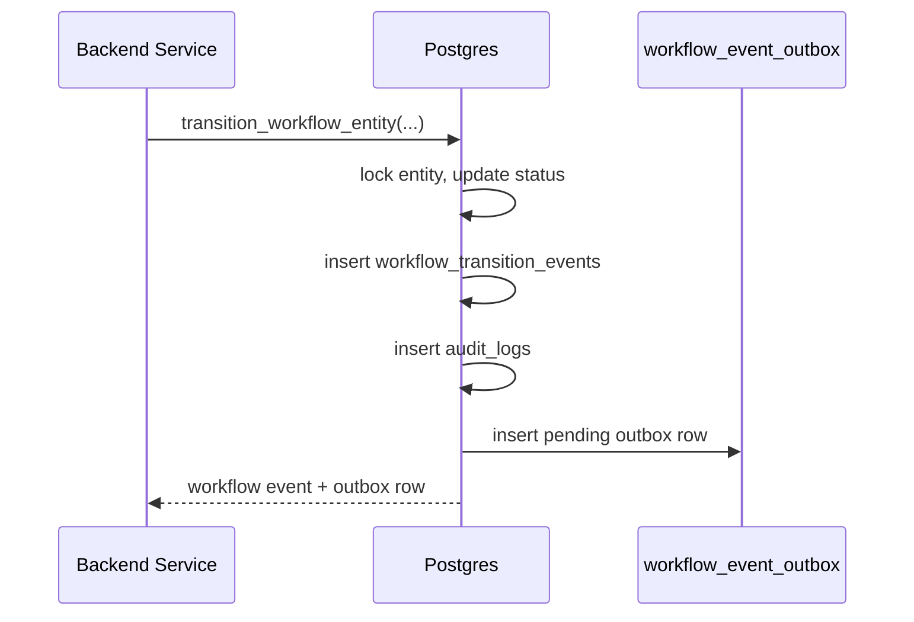
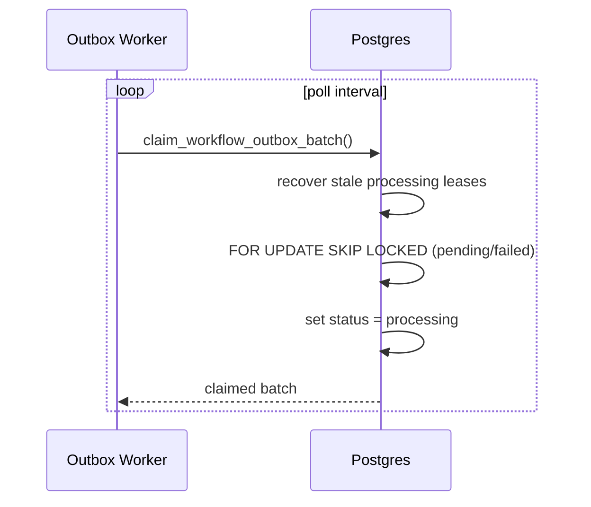
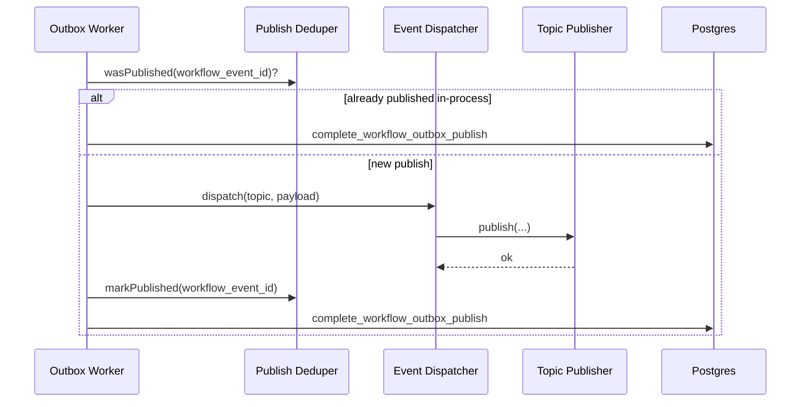
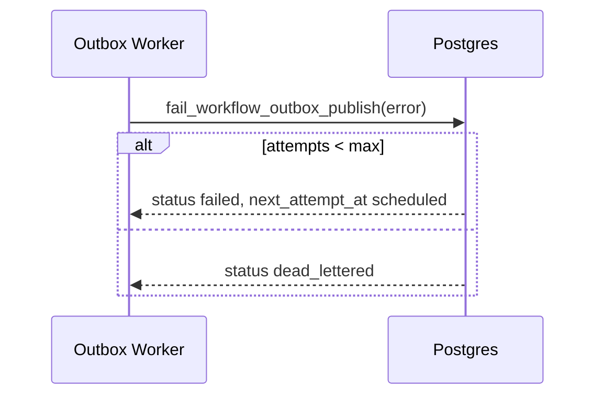

# Event Propagation Flow

End-to-end flow from workflow transition to downstream consumers.

## 1. Transition Command (Transactional)

All writes commit or roll back together. No orphan status changes without events or outbox rows.

## 2. Outbox Claim (Worker)

## 3. Publish + Acknowledge

On failure:

## Payload Contract

Outbox `payload` is built by `transition_workflow_entity` and includes:

- `workflow_event_id`
- `entity_type`, `entity_id`
- `from_status`, `from_status_version`
- `to_status`, `to_status_version`
- `transition_rule_id`, `transition_rule_version`
- `correlation_id`, `transition_source`, `created_at`

Consumers should treat `workflow_event_id` as the idempotency key for side effects.

## Consumer Guidance

- Subscribe by `topic` (for example `workflow.events` or rule-specific realtime topics).
- Never infer lifecycle truth from outbox delivery alone; read entity status and transition history for authority.
- Design handlers to be idempotent: at-least-once delivery is expected until `published`.
- Keep transition orchestration in services using `transition_workflow_entity`; keep propagation in outbox workers.

## Local Worker Entrypoint

`runWorkflowOutboxWorker()` in `src/backend/workers/run-workflow-outbox-worker.ts` wires the admin Supabase client and logging publisher for development and operational smoke tests.
